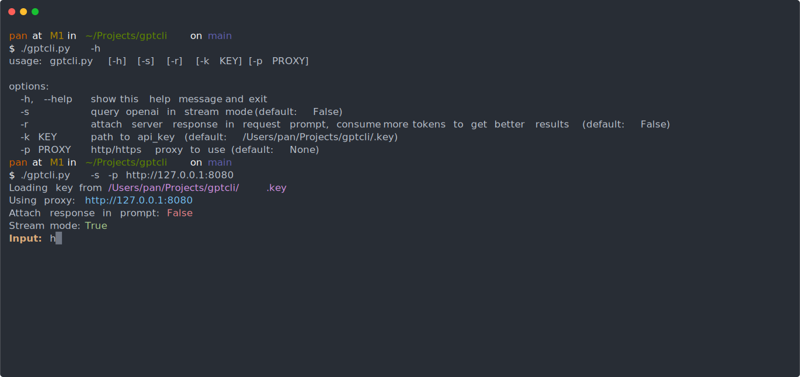

Take chatGPT into command line.

[][vid]

# Setup

1. clone this repo
2. pip3 install -U -r requirements.txt
3. get your [OPENAI_API_KEY][key] and put it in `config.json`

# Run

```sh
$ ./gptcli.py -h
usage: gptcli.py [-h] [-c CONFIG]

options:
  -h, --help  show this help message and exit
  -c CONFIG   path to config.json (default: config.json)
```

Sample `config.json`:
```js
{
    "key": "",                  // your api-key, will read from OPENAI_API_KEY envronment variable if empty
    "model": "gpt-3.5-turbo",   // GPT Model
    "stream": true,             // Stream mode
    "response": true,           // Attach response in prompt, consume more tokens to get better results
    "proxy": "",                // Use http/https/socks4a/socks5 proxy for requests to api.openai.com
    "prompt": [                 // Customize your prompt
        { "role": "system", "content": "Show your response in Markdown format with syntax highlight if it contains code, or just plaintext" },
        { "role": "assistant", "content": "OK" }
    ]
}
```

Supported model:

- [x] gpt-3.5-turbo
- [x] gpt-4
- [x] gpt-4-32k


Console help (with tab-complete):
```
$ ./gptcli.py
Input: -h
usage: Input [-help] [-reset] [-exit] [-multiline]

options:
  -help       show this help message
  -reset      reset session, i.e. clear chat history
  -exit       exit console
  -multiline  input multiple lines, end with ctrl-d(Linux/macOS) or ctrl-z(Windows). cancel with ctrl-c
```

Run in Docker:

```sh
# build
$ docker build -t gptcli:latest .

# run
$ docker run -it --rm -v $PWD/.key:/gptcli/.key gptcli:latest -h

# for host proxy access:
$ docker run --rm -it -v $PWD/config.json:/gptcli/config.json --network host gptcli:latest -c /gptcli/config.json
```

# Feature

- [x] Session based
- [x] Markdown support
- [x] Syntax highlight
- [x] Proxy support
- [x] Multiline input
- [x] Stream output

# TODO

- [ ] Save and load session from file

# LINK

- https://platform.openai.com/docs/introduction
- https://platform.openai.com/docs/api-reference/completions
- https://platform.openai.com/account/api-keys

[vid]: https://asciinema.org/a/564585
[key]: https://platform.openai.com/account/api-keys