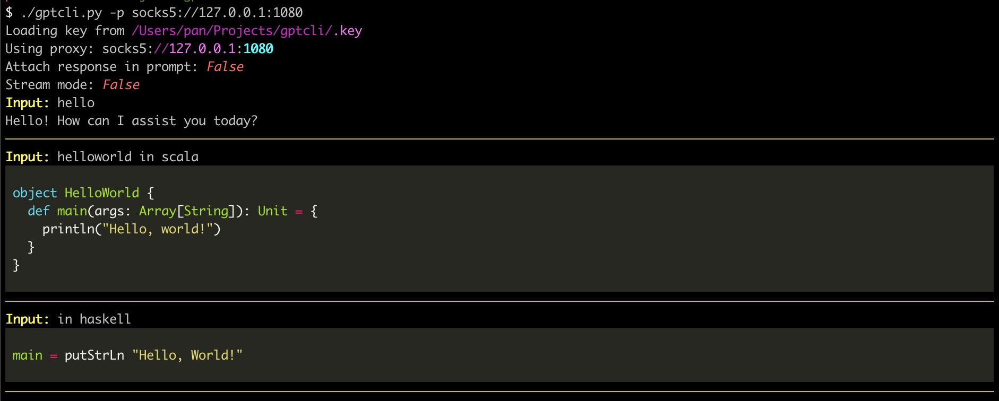

# Setup

1. clone this repo
2. pip3 install -U -r requirements.txt
3. get your apikey from <https://platform.openai.com/account/api-keys> and put it in `.key`

# Run

```sh
$ ./gptcli.py -h
usage: gptcli.py [-h] [-k KEY] [-p PROXY]

options:
  -h, --help  show this help message and exit
  -k KEY      path to api_key (default: .key)
  -p PROXY    http/https proxy to use (default: None)
```

# Feature

- [x] Session based
- [x] Markdown support
- [x] Syntax highlight

# Example




# LINK

- https://platform.openai.com/docs/introduction
- https://platform.openai.com/docs/api-reference/completions
